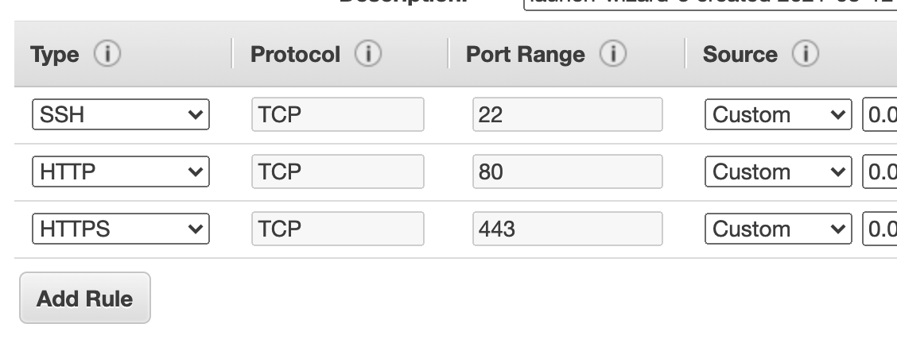
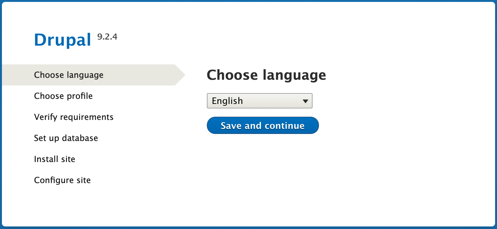
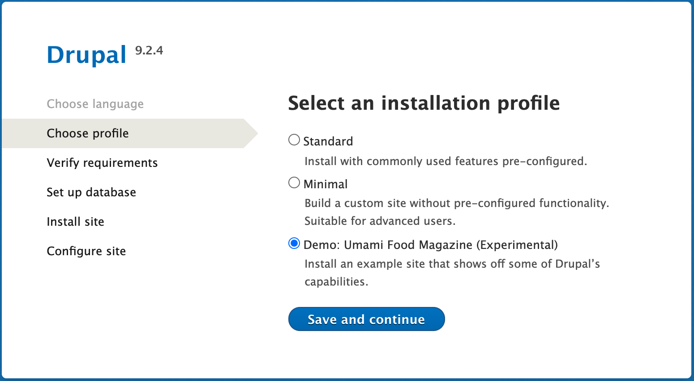

# How to set up a puzzle EC2 instance

## Setting up the server

Amazon allows you to run small servers for free. You can learn more about it [here](https://aws.amazon.com/free/).

You will need to create an Amazon Web Services (AWS) account, and then launch an EC2 instance.  There are a number of online guides explaining how to do this. (I would try to explain here, but my account is already all configured so I would worry about missing out some steps that would be important for you.)

You will need to set up SSH keys in order to be able to access your server.  This should be covered in the guides (or in the AWS guide).

Two things to note:

1. When you launch a new instance, you will be asked to select an Amazon Machine Image (AMI).  Choose “Amazon Linux 2 AMI”.
2. Most of the other question, you can accept the defaults, but when you get to “Step 6: Configure Security Group”, make sure that you add HTTP and HTTPS rules for your server, to allow you to view the website:



Once you have launched your EC2 instance, it will take a few minutes to initialize.  When it is fully launched, find the “public IP address” - you will use this to SSH into your server.

Once you are into the server, we can go about setting up the software we are going to “troubleshoot”.

## Grabbing my scripts and data

We will just run everything as root for the sake of ease - obviously this is not best practice.  But for now, use the `sudo` command to start a shell as the root user, before we continue:  `sudo -s`

Go to the `/tmp` directory and download the bundle of my scripts and test data, then unzip it into the `/opt` directory:


```
cd /tmp
wget https://github.com/vhata/puzzleserver/archive/refs/heads/main.zip
cd /opt
unzip /tmp/main.zip
```

This will leave the scripts and data in a directory called `/opt/puzzleserver-main`, which we can use later.

## Installing the webserver

First, we need to install the webserver and supporting packages.


Amazon uses a strange system where you have to use “amazon-linux-extras” to get a lot of normal software.  So, first we install that package, and then use it to enable a more recent version of PHP.  We’ll then clean the YUM package manager’s metadata (in case it has cached old versions), and then install the PHP packages we need, and the webserver.  Finally, when we’ve done that, we’ll start the webserver to get it up and running:

```
yum install -y amazon-linux-extras
amazon-linux-extras enable php7.4
yum clean metadata

yum install php-fpm php-xml php-gd php-pdo php-mysqlnd php-mbstring
yum install httpd

systemctl start httpd
```

YUM will prompt you for whether or not you want to continue.  If you want to skip this prompt, you can use `yum install -y` like we did in the first line.

## Installing the database

Now to install the database and set up the fake data.

Installing the database is as simple as:

```
amazon-linux-extras install mariadb10.5
systemctl start mariadb
```

Now we need to connect to the server and create a database to hold our data.  Run the `mysql` command to connect to it (by default it connects to the one running on the local server, and we have no authentication set up, so this should just work), and then run the SQL command “`create database botdb`” as follows (remember the semicolon at the end of commands, and use “exit” to exit):


```
# mysql
Welcome to the MariaDB monitor.  Commands end with ; or \g.
Your MariaDB connection id is 52
Server version: 10.5.10-MariaDB MariaDB Server

Copyright (c) 2000, 2018, Oracle, MariaDB Corporation Ab and others.

Type 'help;' or '\h' for help. Type '\c' to clear the current input statement.

MariaDB [(none)]> create database botdb;
Query OK, 1 row affected (0.00 sec)

MariaDB [(none)]> exit
Bye
```

Now we can unzip and import the test data we downloaded earlier:

```
cd /opt/puzzleserver-main/data
bunzip2 dbdump.sql.bz2
mysql botdb < dbdump.sql
```

## Installing the website

The website software we’re going to use is a common Content Management System (CMS) called Drupal.  We’ll just use its out-of-the-box demo.

The webserver expects to find the default website in the directory `/var/www/html` (which is empty by default).  We are going to put Drupal’s source code in there.

Still in your root shell, change to the directory above the default website directory, and grab the archive of the latest Drupal sourcecode.  We then unpack the archive, remove the empty default directory, and replace it with the drupal directory that we got from the archive.  Finally, we will change the permissions of this directory to be owned by the `apache` user (which is the user that the web server runs as).

```
cd /var/www
wget https://www.drupal.org/download-latest/tar.gz
tar xf tar.gz
rmdir html
mv drupal* html

chown -R apache html/
```

There is one little tweak to webserver configuration we need to do for Drupal to work properly.  Use your favourite text editor to open `/etc/httpd/conf/httpd.conf` and scroll down until you find the section for the `/var/www/html` directory, that looks something like this:


```
<Directory "/var/www/html">
    # ...
    # The Options directive is both complicated and important.
    Options Indexes FollowSymLinks

    # AllowOverride controls what directives may be placed in .htaccess files.
    # It can be "All", "None", or any combination of the keywords:
    #   Options FileInfo AuthConfig Limit
    #
    AllowOverride None

    # Controls who can get stuff from this server.
    #
    Require all granted
</Directory>
```

Change `AllowOverride None`  to say  `AllowOverride All`

Of course, we need to restart the webserver for this change to take effect:  `systemctl restart httpd`.

Next, we’ll need to create a database for Drupal.  The MySQL commands (to be run after you connect to the server with the `mysql` shell command) are as follows:
Next, we’ll need to create a database for


```
MariaDB [(none)]> create database drupal;
Query OK, 1 row affected (0.00 sec)

MariaDB [(none)]> grant all on drupal.* to 'drupal'@'localhost' identified by 'secret123';
Query OK, 0 rows affected (0.01 sec)
```

Now, in your browser, open the IP address of your EC2 instance.  If all goes well, you should see something like this:



Choose your language, and then on the next step, select the demo site:



When you get to the “Verify requirements” step, you will probably get a warning about PHP OPcode caching not being enabled.  We’re not going to do this, because we specifically don’t want our website to behave well, for the purposes of the exercise.

Everything else should be all fine - there should be no other warnings or errors.  (If there are, please let me know!  I’d like to improve this guide.)

Scroll to the bottom and select “continue anyway”.

On the next screen, you will be prompted to enter your database details.  As you recall from earlier, the database name is “**drupal**”, the username is “**drupal**”, and the password is “**secret123**”.

When you click to continue, you should see Drupal start to install itself!

The final step is to put in some details for the Drupal website.  You don’t need to put real details, of course, but I suggest that you do put a username and password, as that will let you login as an “admin” of the website.  We won’t be using the website for anything except testing this server debugging, but Drupal has an internal cache of pages, and that can hide the poor performance of the server that we are going to be creating.  If you want to see how Drupal is performing without its caching, at any point, you can go to http://1.2.3.4/en/admin/config/development/performance - with your server’s IP, of course, and use that page to clear the cache.

## Installing debugging tools

There are a number of useful tools that you can use to debug this server. Let’s install them and you can read their man pages (or Google them) to see how to use each one.  The first line enables the “Extra Packages for Enterprise Linux” package repository so that we can access the packages.

```
sudo amazon-linux-extras install epel
sudo yum install sysstat atop htop iotop
```

The `sysstat` package installs several tools that may or may not be of interest.  You can see which ones it installed by running `rpm -ql sysstat` and seeing what files are in the `/usr/bin` directory.

There is a useful page on getting `sar` and `atop` nicely configured [here](https://aws.amazon.com/premiumsupport/knowledge-center/ec2-linux-configure-monitoring-tools/).  These two tools run regularly and store diagnostic information that you can browse at any time.

## Causing trouble on the server

Finally, we get to the point of this exercise: hammering the server so you can use debugging tools to investigate.

Firstly, I recommend familiarizing yourself with `tmux`. This is a tool that lets you run a shell in a sort of window in the background, to which you can connect and disconnect at will.  This will allow you to run the scripts continuously while you do your investigations in another window.

We will also need a package called `ImageMagick`, which provides a number of image manipulation tools. One of them (`mogrify`) uses CPU fairly heavily to convert image formats, which we are going to use to simulate CPU load.

Let’s install those two tools:

```
sudo yum install tmux ImageMagick
```

The three scripts I have provided each do something different to simulate load on the server:

* **img.sh**: Runs `mogrify` from the ImageMagick suite with non-uniform adaptive resizing against a large image. This simulates high CPU and I/O utilization
* **disk.sh**: Runs `dd` to write 500 MB of content to disk, simulating high I/O utilization
* **db.sh**: Performs expensive joins on non-indexed tables in MariaDB to simulate heavy DB load.

These scripts are located where we downloaded them from Github, at `/opt/puzzleserver-main/scripts`.

Now, inside various windows in your tmux session, we are going to run each one of the three scripts in a loop.  Note that we’re going to create a file called `XX-running` and only loop while that file exists.  This allows us to easily abort the whole thing (or individual loops) by deleting those files: `rm /opt/puzzleserver-main/scripts/*running`.

The commands to get each script going are similar.  Remember to jump to root with `sudo -s` before doing this!

Database:

```
cd /opt/puzzleserver-main/scripts
touch db-running
while [ -e db-running ] ; do ./db.sh ; done
```

Disk:

```
cd /opt/puzzleserver-main/scripts
touch disk-running
while [ -e disk-running ] ; do ./disk.sh ; done
```

And image:

```
cd /opt/puzzleserver-main/scripts
touch img-running
while [ -e img-running ] ; do ./img.sh ; done
```

Once you have those running, wait a minute or two for load to build up, and then try loading one of the pages of your Drupal website.  You should start to see a noticeable slowdown!

From there, you can use the tools we installed (or any others you might want to experiment with) to investigate the “problems” on the system!

# Credits

Source image from https://unsplash.com/photos/t8a7Cg17W1k

Database dump from an old bot that ran on irc.zanet.net
